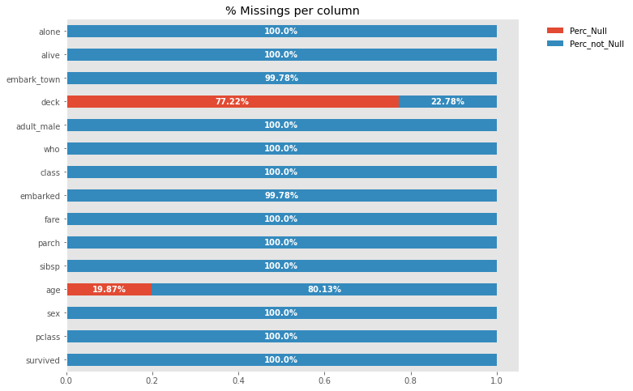
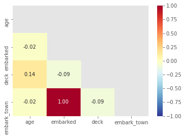
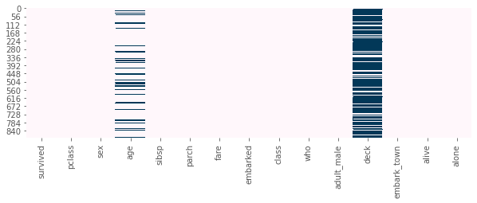
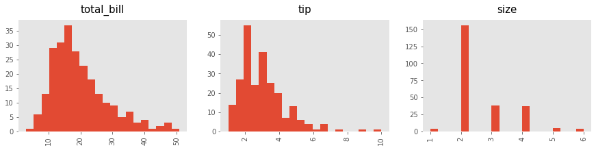
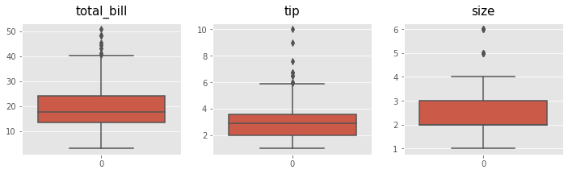
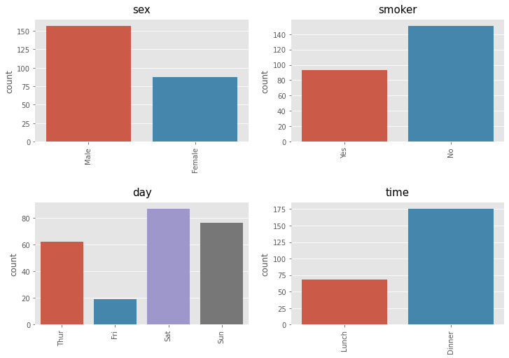
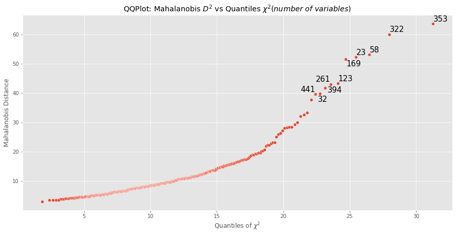
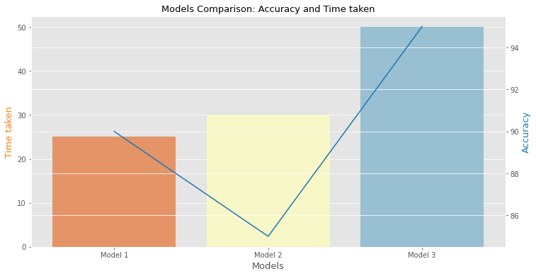
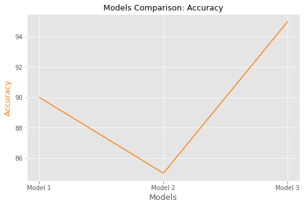

[![Contributors][contributors-shield]][contributors-url]
[![Forks][forks-shield]][forks-url]
[![Stargazers][stars-shield]][stars-url]
[![Issues][issues-shield]][issues-url]
[![MIT License][license-shield]][license-url]


# Broomlib 
## Description 
A package to analyze datasets and plot the numerical and categorical features in a set of data quickly and efficiently. 
***
## Installation
To install this package use `pip install broomlib`
***
## Dependencies
This package has needs the following in order to work: 
* matplotlib 
* tensorflow
* seaborn
* scikit-learn
* plotly
* whatever else just add it here
***

<a name = 'index'> </a>
## Functions
Here is a brief overview of the functions available in this package. To further explore any of them, click on the link.

### Data Cleaning
* <a href = #show_all>show_all</a> 
* <a href = #data_report>data_report</a> 
* <a href = #how_missing>how_missing</a>
* <a href = #checking_duplicates>checking_duplicates</a>
* <a href = #building_date>building_date</a>
* <a href = #search_corr>search_corr</a>
* <a href = #suggested_merge>suggested_merge</a>
* <a href = #detrending>detrending</a>
* <a href = #fill_missing>fill_missing</a>

### Visualization 

* <a href = #missing_bars>missing_bars</a>
* <a href = #missings_heatmap>missings_heatmap</a>
* <a href = #missing_matrix>missings_matrix</a>
* <a href = #grid_displots>grid_displots</a>
* <a href = #grid_boxplots>grid_boxplots</a>
* <a href = #grid_cat_bars>grid_cat_bars</a>
* <a href = #grid_cat_target_bars>grid_cat_target_bars></a>
* <a href = #corr_bars>corr_bars</a>
* <a href = #outliers_mahalanobis_plot>outliers_mahanalobis_plot</a>
* <a href = #accuracy_time_ML>accuracy_time_ML</a>
* <a href = #accuracy_ML>accuracy_ML</a>

### Machine Learning

* <a href = #transformdict>transformdict</a>
* <a href = #broomResample>broomResample</a>
* <a href = #pca_analisis>pca_analisis</a>

***
## Documentation
### **Data Cleaning**
<a href="#index"><p align="right" href="#index">Back to index</p></a>

<a name = 'show_all'></a>

#### **show_all** *(`df = None`, `big_desc = False`)*
Shows the info, number of rows and a big or small description with mode, mean, median, missings, categorical and numerical columns...

**Parameters**
* **df** (*Pandas Dataframe*): Dataframe we want to check.
* **big_desc** (*bool*) (`default = False`): If True displays count, nulls, type, unique, numeric, mode, mean, min, quantile, median, max, std, skew and kurt of each column.

**Returns**
If `big_desc = True` returns Pandas Dataframe with a big description

Otherwise returns the info, shape of each row and the pandas [describe](https://pandas.pydata.org/docs/reference/api/pandas.DataFrame.describe.html) method.
****
<a href="#index"><p align="right" href="#index">Back to index</p></a>
<a name = 'data_report'></a>

#### **data_report** *(`df = None`)*
Shows a small summary of the type, percentage of missings, unique values ad cardinality of each column.

**Parameters**

* **df** (*Pandas Dataframe*): Dataframe we want to check.

**Returns** 

Datafrane with the types, percentage of missings, unique values and cardinality of each column.
***
<a href="#index"><p align="right" href="#index">Back to index</p></a>
<a name = 'how_missing'></a>

#### **how_missing** *(`df = None`, `threshold = 0.0`, `drop = False`)*
Shows the percentage of missing values. Optional: establish a lower threshold for the values to be displayed and delete the columns meeting this criteria. 

**Parameters** 
* **df** (*Pandas dataframe*): Dataframe we want to check.
* **threshold** (*float*) (`default = 0`): Minimum percentage of missings in a column that will be displayed. Goes from 0 to 100
* **drop** (*bool*) (`default = False`): If True, deletes the columns exceding the threshold. Warning: deletes from the original df.  

**Returns** 

Dataframe with the name of the columns and the percentage of missings in each. 

***
<a href="#index"><p align="right" href="#index">Back to index</p></a>
<a name = 'checking_duplicates'></a>

#### **checking_duplicates** *(`df = None`, `col = None`)*
Checks if there are duplicate values due to capitalization in a column of strings. (E.g: 'Spain' and 'spain')

**Parameters** 

* **df** (*Pandas Dataframe*): dataframe we want to check.
* **col** (*string*): name of the column. Should be made up of strings. 

**Returns**

The duplicate values. If none exist, it will display a message stating so. 

***
<a href="#index"><p align="right" href="#index">Back to index</p></a>
<a name = 'building_date'></a>

#### **building_date** *(`year = None`, `month = None`, `day = None`, `df = None`)*

Combines separate year, month and day columns into a single date column. 

**Params** 

* **year** (*string*): name of the colum in which the years are. 
* **month** (*string* or *int*): name of the column in which the years are. Values can be integrers [0,12] or strings with the name of the month in English. 
* **day** (*string* or *int*): name of the column with the days. Values need to be integers [0,31]. 

**Returns** 

Original dataframe with a new column `'Parsing date'` in the datetime64 numpy type. It will drop the original columns with years, months and days. 

***
<a href="#index"><p align="right" href="#index">Back to index</p></a>
<a name = 'search_corr'></a>

#### **search_corr** *(`df = None`, `threshold`)*:
Searches for correlations within the indicated dataframe based on the threshold value. 

**Parameters** 
* **df** (*Pandas Dataframe*): dataframe we want to check.
* **threshold** (*float*) : Minimum value for a correlation to be displayed.

**Returns**
List with the number of elements that exceed the threshold and their name.
***
<a href="#index"><p align="right" href="#index">Back to index</p></a>
<a name = 'suggested_merge'></a>

#### **suggested_merge** *(`df1 = None`, `df2 = None`)*
Compare a dataframe with another dataframe in search of columns in common and recommend which type of union according to its composition is the most appropriate. 

**Parameters** 
    
- **df1** (*Pandas DataFrame*): first dataframe we want to compare.
- **df2** (*Pandas DataFrame*): dataframe we want to compare it to.

**Returns**

If the columns are found, it will return the name and the union recommended.
Otherwise, it recommneds a left or right join.

***
<a href="#index"><p align="right" href="#index">Back to index</p></a>
<a name = 'detrending'></a>

#### **detrending** *(`df = None`, `value`, `frac`)*:
The function calculates the trend of an ordered and continuous property extracted from a column of a dataframe using the Lowess algorithm. It also calculates the residuals.

The function displays the three curves (original, trend, residual) and outputs them in a new dataframe. Input data does not not have to be time-series but needs to be continuous and ordered.

It can also contain missing values.

**Parameters:**
* **df** (*Pandas DataFrame*):mandatory parameter. Dataframe with the column containing the property to be processed.

* **value** (*string*): mandatory parameter. Name of the column containing the property to be processed.
        
* **frac** (*float*) {0.0 to 1.0}: mandatory parameter. Smoothness of the trend. The higher the value the smoother the trend. 

**Returns**

Dataframe

From the original dataframe, it returns a new dataframe containing the three following columns: 
the original curve, the trend curve and the residual curve.

*** 
<a href="#index"><p align="right" href="#index">Back to index</p></a>
<a name = 'fill_missing'></a>

#### **fill_missing** *(`df = None`, `column = None`, `dropna=False`, `type_treatment=None`)*:
The function picks one DataFrame and the name of one column with missings.The user can decide how to treat that column. 

Parameters:
* df (*Pandas DataFrame*): 
        mandatory parameter. Dataframe  we want to check .
* column(*string*):
        name of the column that will be droped or filled

* dropna (*boolean*) (`Default = False`): 
        True if you want drop that colum.
        
* type_treatment (*string*):
Can be: 
  - mean  --> for mean treatment
  - mode  --> for mode treatment
  - value --> for fill with that value

**Returns** 

Dataframe

***

### **Visualization**
<a href="#index"><p align="right" href="#index">Back to index</p></a>
<a name = 'missing_bars'></a>

#### **missing_bars** *(`data = None`, `figsize = (10,3)`, `style = 'ggplot'`)*

Presents a horizontal barplot with the percentage of missings in each feature.

**Parameters**
* df (*Pandas Dataframe*): Dataframe we want to check.
* figsize (*tuple*) (`default = (10, 3)`): A matplotlib parameter to establish the size of the figure. 
* style (*str*): Style of the figure to display. Full list available [here](https://matplotlib.org/stable/gallery/style_sheets/style_sheets_reference.html).

**Returns**

A figure

**Example**

```Py
from broomlib import visualization as vis
import seaborn as sns
titanic = sns.load_dataset("titanic")
vis.missing_bars(titanic, figsize=(10, 3), style='ggplot')
```


****
<a href="#index"><p align="right" href="#index">Back to index</p></a>
<a name = 'missings_heatmaps'></a>

#### **missings_heatmaps** *(`df = None`, `figsize = (12, 10)`, `style = 'ggplot'`, `cmap = 'RdYlBu'`)*
Presents a heatmap visualizationof nullity correlation in the give. Dataframe. 

**Parameters** 
* **df** (*Pandas Dataframe*): Dataframe we want to check.
* **figsize** (*tuple*) (`default = (12,10)`): A matplotlib parameter to establish the size of the figure.
* **style** (*str*): Style of the figure to display. Full list available [here](https://matplotlib.org/stable/gallery/style_sheets/style_sheets_reference.html).
* **cmap** (*str*): What matplotlib colormap to use. Full list available [here](https://matplotlib.org/stable/tutorials/colors/colormaps.html).

**Returns**

A figure.

**Example** 

```Py
from broomlib import visualization as vis
import seaborn as sns
titanic = sns.load_dataset("titanic")
vis.missing_heatmap(titanic, figsize=(6, 4), style='ggplot', cmap='RdYlBu_r')
```


***
<a href="#index"><p align="right" href="#index">Back to index</p></a>
<a name = 'missing_matrix'></a>
#### **missing_matrix** *(`df`, `figsize=(12, 12)`, `style='ggplot'`, `cmap='PuBu'`)*
Presents a visualization of the null values in the given dataframe.

**Parameters**
* **df** (*Pandas Dataframe*): Dataframe we want to check.
* **figsize** (*tuple*) (`default = (12,10)`): A matplotlib parameter to establish the size of the figure.
* **style** (*str*): Style of the figure to display. Full list available [here](https://matplotlib.org/stable/gallery/style_sheets/style_sheets_reference.html).
* **cmap** (*str*): What matplotlib colormap to use. Full list available [here](https://matplotlib.org/stable/tutorials/colors/colormaps.html).

**Returns**

A figure

**Example** 

```Py
from broomlib import visualization as vis
import seaborn as sns
titanic = sns.load_dataset("titanic")
missing_matrix(titanic, figsize=(10, 3), style='ggplot', cmap='PuBu')
```


***

<a href="#index"><p align="right" href="#index">Back to index</p></a>
<a name = 'grid_displots'></a>

#### **grid_displots** *(`df = None`, `figsize=(12, 4)`,` cols=3`, `bins=20`, `style='ggplot'`, `fontsize=12`, `y_space=0.35`)*

Presents the distribution of each numerical variable. Will not work with categorical variables.

**Parameters** 

* **df** (*Pandas Dataframe*): Dataframe we want to check.
* **figsize** (*tuple*) (`default = (12,4)`): A matplotlib parameter to establish the size of the figure.
* **cols** (*int*) (`default = 3`): number of plots displayed in parallel.
* **bins** (*int*) (`default = 20`): number of equal-width bins in the range. 
* **style** (*str*): Style of the figure to display. Full list available [here](https://matplotlib.org/stable/gallery/style_sheets/style_sheets_reference.html).
* **fontsize** (*int*) (`default = 12`): The figure's font size.
* **y_space** (*float*) (`default = 0.35`): Space between rows.

**Returns**

A figure.

**Example** 
```Py
from broomlib import visualization as vis
import seaborn as sns
tips = sns.load_dataset('tips')
vis.grid_displots(tips, figsize=(15, 3), cols=3, bins=20, fontsize=15, y_space=0.5, style='ggplot')
```


***
<a href="#index"><p align="right" href="#index">Back to index</p></a>
<a name = 'grid_boxplots'></a>

#### **grid_boxplots** *(`df = None`, `figsize=(15, 15)`, `cols=3`, `bins=20`, `style='ggplot'`, `fontsize=12`, `y_space=0.35`, `whis=1.5`)*:

Displays a seaborn boxplot visualization of each numeric column in the given dataframe. 

**Parameters** 
* **df** (*Pandas Dataframe*): Dataframe we want to check.
* **figsize** (*tuple*) (`default = (15,15)`): A matplotlib parameter to establish the size of the figure.
* **cols** (*int*) (`default = 3`): number of plots displayed in parallel.
* **bins** (*int*) (`default = 20`): number of equal-width bins in the range.
* **style** (*str*): Style of the figure to display. Full list available [here](https://matplotlib.org/stable/gallery/style_sheets/style_sheets_reference.html).
* **fontsize** (*int*) (`default = 12`): The figure's font size.
* **y_space** (*float*) (`default = 0.35`): Space between rows.
* **whis** (*float*) (`default = 1.5`): The position of the whiskers. 1.5 corresponds to Tukey's original definition of boxplots.

**Returns**

A figure.

**Example** 

```Py
from broomlib import visualization as vis
import seaborn as sns
tips = sns.load_dataset('tips')
vis.grid_boxplots(tips, figsize=(12, 3), cols=3, fontsize=15, y_space=0.5, style='ggplot')
```


*** 
<a href="#index"><p align="right" href="#index">Back to index</p></a>
<a name = 'grid_cat_bars'></a>

#### **grid_cat_bars** *(`df = None`, `n_categories=10` ,`figsize=(12, 4)`, `cols=3`, `bins=20`, `style='ggplot'`, `fontsize=12`, `y_space=0.35`)*

Shows the distribution of each categorical variable. It works with categorical features. 

**Parameters** 
* **df** (*Pandas Dataframe*): Dataframe we want to check.
* **n_categories** (*int*): Number of categorical columns.
* **figsize** (*tuple*) (`default = (12,4)`): A matplotlib parameter to establish the size of the figure.
* **cols** (*int*) (`default = 3`): number of plots displayed in parallel.
* **bins** (*int*) (`default = 20`): number of equal-width bins in the range.
* **style** (*str*): Style of the figure to display. Full list available [here](https://matplotlib.org/stable/gallery/style_sheets/style_sheets_reference.html).
* **fontsize** (*int*) (`default = 12`): The figure's font size.
* **y_space** (*float*) (`default = 0.35`): Space between rows.

**Returns**

A Figure

**Example**
```Py
from broomlib import visualization as vis
import seaborn as sns
tips = sns.load_dataset('tips')
vis.grid_cat_bars(tips, figsize=(12, 8), cols=2, fontsize=15, y_space=0.5, style='ggplot')
```




***
<a href="#index"><p align="right" href="#index">Back to index</p></a>
<a name = 'grid_cat_target_bars'></a>

#### **grid_cat_target_bars** *(`df = None`, `target = None`, `n_categories=10`, `figsize=(12, 4)`, `cols=3`, `bins=20`, `style='ggplot'`, `fontsize=12`, `y_space=0.35`)*

Shows the distribution of each categorical variable compared wiith the categorical target. 

**Parameters** 
* **df** (*Pandas Dataframe*): Dataframe we want to check.
* **target** (*Pandas Dataframe column*): The categorical target.
* **n_categories** (*int*): Number of categorical columns.
* **figsize** (*tuple*) (`default = (12,4)`): A matplotlib parameter to establish the size of the figure.
* **cols** (*int*) (`default = 3`): number of plots displayed in parallel.
* **bins** (*int*) (`default = 20`): number of equal-width bins in the range.
* **style** (*str*): Style of the figure to display. Full list available [here](https://matplotlib.org/stable/gallery/style_sheets/style_sheets_reference.html).
* **fontsize** (*int*) (`default = 12`): The figure's font size.
* **y_space** (*float*) (`default = 0.35`): Space between rows.

**Returns**

A Figure

**Example**
```Py
from broomlib import visualization as vis
import seaborn as sns
titanic = sns.load_dataset("titanic")
vis.grid_cat_target_bars(titanic, target=titanic['survived'], figsize=(15, 12), cols=3, fontsize=15, y_space=0.55, style='ggplot')
```


***
<a href="#index"><p align="right" href="#index">Back to index</p></a>
<a name = 'corr_bars'></a>

#### **corr_bars** *(`data = None`, `threshold = None`, `figsize=(10, 3)`, `style='ggplot'`)*

Displays a horizontal bar plor of the most correlated feature pairs and their correlation coeffcient. Works with numerical features. 

**Parameters** 
* **df** (*Pandas Dataframe*): Dataframe we want to check.
* **threshold** (*float*): cut off point for the value of the correlation coefficient which points out that there is a significant correlation between two features.
* **figsize** (*tuple*) (`default = (10,3)`): A matplotlib parameter to establish the size of the figure.
* **style** (*str*): Style of the figure to display. Full list available [here](https://matplotlib.org/stable/gallery/style_sheets/style_sheets_reference.html).

**Returns**

A Figure

**Example** 
```Py
from broomlib import visualization as vis
import seaborn as sns
mpg = sns.load_dataset('mpg')
vis.corr_bars(mpg, threshold=0.6, figsize=(13, 6))
```


*** 
<a href="#index"><p align="right" href="#index">Back to index</p></a>
<a name = 'outliers_mahalanobis_plot'></a>

#### **outliers_mahalanobis_plot** *(`x = None`, `extreme_points = 10`, `style = 'ggplot'`, `figsize = (15,7)`)*:

Shows outliers of the dataset. It compares Mahalanobis Distance of each point to Chi Square Distribution. Points with index are the most extreme ones (outliers) in the dataset. Works with numerical features. 

**Parameters**
* **x** (*Pandas Dataframe*): Dataframe we want to check. Note: performance is affected if rows > 2500.
* **extreme_points** (*int*) (`default = 10`): Number of outliers the user can visualize (with its index).
* **figsize** (*tuple*) (`default = (15,7)`): A matplotlib parameter to establish the size of the figure.
* **style** (*str*): Style of the figure to display. Full list available [here](https://matplotlib.org/stable/gallery/style_sheets/style_sheets_reference.html).

**Returns**

A figure

**Example**
```Py
from broomlib import visualization as vis
from sklearn import datasets
diabetes = datasets.load_diabetes()
df = pd.DataFrame(diabetes.data)
vis.outliers_mahalanobis_plot(df, extreme_points=10, figsize=(15,7), style='ggplot')
```



***
<a href="#index"><p align="right" href="#index">Back to index</p></a>
<a name = 'accuracy_time_ML'></a>

#### **accuracy_ML** *(`df`, `figsize=(6, 6)`, `style='ggplot'`, `cmap='RdYlBu'`)*
Shows a barplot comparing time to accuracy for different machine learning models.

**Parameters** 

* **df** (*Pandas Dataframe*): Dataframe we want to check.
* **figsize** (*tuple*) (`default = (12,10)`): A matplotlib parameter to establish the size of the figure.
* **style** (*str*): Style of the figure to display. Full list available [here](https://matplotlib.org/stable/gallery/style_sheets/style_sheets_reference.html).
* **cmap** (*str*): What matplotlib colormap to use. Full list available [here](https://matplotlib.org/stable/tutorials/colors/colormaps.html).

**Returns**

A Figure

**Example** 
```
from broomlib import visualization as vis
df = pd.DataFrame({'Models': ['Modelo 1', 'Modelo 2', 'Modelo 3'], 
      'Accuracy': [90, 85, 95],
      'Time taken': [25, 30, 50]})

vis.accuracy_time_ML(df, figsize=(12, 6), cmap='RdYlBu', style='ggplot')
```


***
<a href="#index"><p align="right" href="#index">Back to index</p></a>
<a name = 'accuracy_ML'></a>

#### **accuracy_ML** *(`df`, `figsize=(6, 6)`, `style='ggplot'`, `cmap='RdYlBu'`)*
Displays a graph showing the accuracy of different machine learning models.

**Parameters**

* **df** (*Pandas Dataframe*): Dataframe we want to check.
* **figsize** (*tuple*) (`default = (12,10)`): A matplotlib parameter to establish the size of the figure.
* **style** (*str*): Style of the figure to display. Full list available [here](https://matplotlib.org/stable/gallery/style_sheets/style_sheets_reference.html).
* **cmap** (*str*): What matplotlib colormap to use. Full list available [here](https://matplotlib.org/stable/tutorials/colors/colormaps.html).

**Returns**

A Figure

**Example**
```Py
from broomlib import visualization as vis
df = pd.DataFrame({'Models': ['Model 1', 'Model 2', 'Model 3'], 
      'Accuracy': [90, 85, 95]})

vis.accuracy_ML(df, figsize=(6, 4), cmap='RdYlBu', style='ggplot')
```



### **Machine Learning**

<a href="#index"><p align="right" href="#index">Back to index</p></a>
<a name = 'transformdict'></a>

#### **transformdict** *(`df = None`, `transformation = None`)*
Applies and plot a transformation to the data searching for normality returning the new data.

**Parameters**
* **df** *(Pandas Dataframe)*: Dataframe we want to check.
* **transformation** *(string)* (`default = 'log'`): The transformation applied to the dataframe. The following options are available:
    * `log` : Applies a logarithmic transformation to the data. It will compress the data, reducing the variability of the data.

    * `std` : Employs [StandardScaler](https://scikit-learn.org/stable/modules/generated/sklearn.preprocessing.StandardScaler.html) from Sklearn, putting all the variables in the same unit and deleting the variability of the sample. Not advised if a PCA is to be performed.

    * `inv` : Reverses the data.

    * `Box_Cox` : Translates the data without affecting the analysis. More agressive than the logarithmic transformation but more effective if searching for normalization. Advised against if an agressive non lineal transformation is desired.


    * `sqrt` : Applies a square root transformation to the data.

    * `cuad` : Applies the quadratic transformation. Useful if you want to gain variability.


**Returns**

Transformed dataframe.

*** 
<a href="#index"><p align="right" href="#index">Back to index</p></a>
<a name = 'broomResample'></a>

#### **broomResample** *(`X`, `y`, `sampling_strategy_o=0.1`,`sampling_strategy_u='auto'`,`random_state=None`,`k_neighbors=5`,`n_jobs=None`,`replacement=False`)*

A problem with imbalanced classification is that there are too few examples of the minority class for a model to effectively learn the decision boundary.

One way to solve this problem is to oversample the examples in the minority class. This can be achieved by simply duplicating examples from the minority class in the training dataset prior to fitting a model.
This can balance the class distribution but does not provide any additional information to the model.

Knowing this, the function first uses a random undersampling to trim the number of examples in the majority class, then it uses the Synthetic Minority Oversampling Technique, also called SMOTE, to oversample the minority class to balance the class distribution.

The combination of SMOTE and under-sampling performs better than plain under-sampling.

**Parameters**
* **X** (*pandas Dataframe*): Dataframe we want to check.
* **y** : (*ndarray of shape (n_samples,)*)
  The target array.
  sampling_type : {{'over-sampling', 'under-sampling', 'clean-sampling'}}
  The type of sampling. Can be either ``'over-sampling'``,
  ``'under-sampling'``, or ``'clean-sampling'``.
  kwargs : dict
      Dictionary of additional keyword arguments to pass to
      ``sampling_strategy`` when this is a callable.

* **sampling_strategy_o** (*float*, *str*, *dict* or *callable*) (`default='auto'`): Sampling information to resample the data set.
    - When ``float``, it corresponds to the desired ratio of the number of
    samples in the minority class over the number of samples in the
    majority class after resampling. Therefore, the ratio is expressed as
    $\alpha_{os} = N_{rm} / N_{M}$ where $N_{rm}$ is the
    number of samples in the minority class after resampling and
    $N_{M}$ is the number of samples in the majority class.
    **Warning**:
          ``float`` is only available for **binary** classification. An
          error is raised for multi-class classification.
    - When ``str``, specify the class targeted by the resampling. The
      number of samples in the different classes will be equalized.
      Possible choices are:

          - 'minority': resample only the minority class;
          - 'not minority': resample all classes but the minority class;
          - 'not majority': resample all classes but the majority class;
          - 'all': resample all classes;
          - 'auto': equivalent to 'not majority'.
    - When `dict`, the keys correspond to the targeted classes. The
      values correspond to the desired number of samples for each targeted
      class.
    - When callable, function taking ``y`` and returns a ``dict``. The keys
      correspond to the targeted classes. The values correspond to the
      desired number of samples for each class.
* **sampling_strategy_u** (*float*, *str*, *dict*, *list* or *callable*): 
            Sampling information to sample the data set.

    - When ``float``:
        For **under-sampling methods**, it corresponds to the ratio
        $\alpha_{us}$ defined by $N_{rM} = \alpha_{us}
        \times N_{m}$ where $N_{rM}$ and $N_{m}$ are the
        number of samples in the majority class after resampling and the
        number of samples in the minority class, respectively;
        For **over-sampling methods**, it correspond to the ratio
        $\alpha_{os}$ defined by $N_{rm} = \alpha_{os}
        \times N_{m}$ where $N_{rm}$ and $N_{M}$ are the
        number of samples in the minority class after resampling and the
        number of samples in the majority class, respectively.
        **Warning**:
            ``float`` is only available for **binary** classification. An
            error is raised for multi-class classification and with cleaning
            samplers.

    - When ``str``, specify the class targeted by the resampling. For
      **under- and over-sampling methods**, the number of samples in the
      different classes will be equalized. For **cleaning methods**, the
      number of samples will not be equal. Possible choices are:
        ``'minority'``: resample only the minority class;
        ``'majority'``: resample only the majority class;
        ``'not minority'``: resample all classes but the minority class;
        ``'not majority'``: resample all classes but the majority class;
        ``'all'``: resample all classes;
        ``'auto'``: for under-sampling methods, equivalent to ``'not
        minority'`` and for over-sampling methods, equivalent to ``'not
        majority'``.

    - When ``dict``, the keys correspond to the targeted classes. The
      values correspond to the desired number of samples for each targeted
      class.
      .. warning::
          ``dict`` is available for both **under- and over-sampling
          methods**. An error is raised with **cleaning methods**. Use a
          ``list`` instead.

    - When ``list``, the list contains the targeted classes. It used only
      for **cleaning methods**.
      .. warning::
          ``list`` is available for **cleaning methods**. An error is raised
          with **under- and over-sampling methods**.

    - When callable, function taking ``y`` and returns a ``dict``. The keys
      correspond to the targeted classes. The values correspond to the
      desired number of samples for each class.
* **random_state**(*int*, *RandomState instance*) (`default=None`): 
Control the randomization of the algorithm.
    - If int, ``random_state`` is the seed used by the random number
      generator;
    - If ``RandomState`` instance, random_state is the random number
      generator;
    - If ``None``, the random number generator is the ``RandomState``
      instance used by ``np.random``.
* **k_neighbors** (*int* or *object*), (`default=5`): 
If ``int``, number of nearest neighbours to used to construct synthetic
samples.  If object, an estimator that inherits from
:class:`~sklearn.neighbors.base.KNeighborsMixin` will be used to
find the k_neighbors.
*** n_jobs** (*int*) (`default=None`):
  Number of CPU cores used during the cross-validation loop.
  ``None`` means 1 unless in a :obj:`joblib.parallel_backend` context.
  ``-1`` means using all processors. See
  [Glossary](https://scikit-learn.org/stable/glossary.html#term-n-jobs)
  for more details.
* **replacement** (*boolean*)(`default=False`): Whether the sample is with (default) or without replacement.

**Returns** 
* X_resampled : ndarray, shape (n_samples_new, n_features)
The array containing the resampled data.
* y_resampled : ndarray, shape (n_samples_new)
The corresponding label of `X_resampled`

**Example**

```Py
from broomlib.MachineLearning import broomResample
from imblearn.over_sampling import SMOTE
from imblearn.under_sampling import RandomUnderSampler
from imblearn.pipeline import Pipeline
X, y = make_classification(n_samples=10000, n_features=2, n_redundant=0,
...n_clusters_per_class=1, weights=[0.99], flip_y=0, random_state=1)
counter = Counter(y)
print(counter)
for label, _ in counter.items():
  row_ix = np.where(y == label)[0]
  plt.scatter(X[row_ix, 0], X[row_ix, 1], label=str(label))
  plt.legend()
  plt.show()
X_resampled, y_resampled = broomResample(X,y)
print(f'Resampled dataset samples per class {{Counter(y_resampled)}}')
Resampled dataset samples per class Counter({{0: 900, 1: 900}})
for label, _ in counter.items():
row_ix = np.where(y_resampled == label)[0]
plt.scatter(X_resampled[row_ix, 0], X_resampled[row_ix, 1], label=str(label))
plt.legend()
plt.show()
```
***
<a href="#index"><p align="right" href="#index">Back to index</p></a>
<a name = 'pca_analisis'></a>

#### **pca_analisis** *(`data = None`)*
Makes a feauture importance analysis based on variability. Requires full, balanced data with common units. 

If this is not the case a transformation can be applied via the <a href = #transformdict>transformdict</a> function. 

A principal component analysis is then performed on the data, based on the [SKLearn PCA function](https://scikit-learn.org/stable/modules/generated/sklearn.decomposition.PCA.html). BY using the coordinates in each principal component we can find the importance of each variable. 

Finally, the user is asked if he wants to delete and return the data without these variables.

**Parameters**
* **data** (*pandas Dataframe*): Dataframe we want to check.

**Returns** 

The data with the variables with low variability removed. 
# Contributors
List of people that participated in this project:

* [Juan Manuel Cornejo](https://www.linkedin.com/in/juanmanuelcornejociruelo/)
* [Ana Blanco Delgado](https://www.linkedin.com/in/anablancodelgado/)
* [Gonzalo Pérez Díez](https://www.linkedin.com/in/gonzalo-pérez-díez/)
* [Antonio Pol Fuentes](https://www.linkedin.com/in/antoniopolfuentes)
* [Miguel Anguita Ruiz](https://www.linkedin.com/in/miguel-anguita-ruiz-73205b107/)
* [Laurent Jacquet](https://www.linkedin.com/in/laurent-jacquet-61b513102/)
* [Nieves Noha Pascual](https://www.linkedin.com/in/nieves-noha-pascual)
* [José Antonio Suárez Roig](https://www.linkedin.com/in/josé-antonio-suárez-roig)
* [Olivier Kirstetter](https://www.linkedin.com/in/olivier-kirstetter)
* [Angel Pizarro](https://www.linkedin.com/in/angel-pizarro-sanchez/)


[license-shield]: https://img.shields.io/github/license/GonzaloPerez1/broomlib?style=for-the-badge
[license-url]: https://github.com/GonzaloPerez1/broomlib/blob/main/LICENSE
[contributors-shield]: https://img.shields.io/github/contributors/GonzaloPerez1/broomlib?style=for-the-badge
[contributors-url]: https://github.com/GonzaloPerez1/broomlib/graphs/contributors
[forks-shield]: https://img.shields.io/github/forks/GonzaloPerez1/broomlib?style=for-the-badge
[forks-url]: https://github.com/GonzaloPerez1/broomlib/network/members
[stars-shield]: https://img.shields.io/github/stars/GonzaloPerez1/broomlib?style=for-the-badge
[stars-url]: https://github.com/GonzaloPerez1/broomlib/stargazers
[issues-shield]: https://img.shields.io/github/issues/GonzaloPerez1/broomlib?style=for-the-badge
[issues-url]: https://github.com/GonzaloPerez1/broomlib/issues
[license-shield]: https://img.shields.io/github/license/GonzaloPerez1/broomlib?style=for-the-badge
[license-url]: https://github.com/othneildrew/Best-README-Template/blob/master/LICENSE.txt

